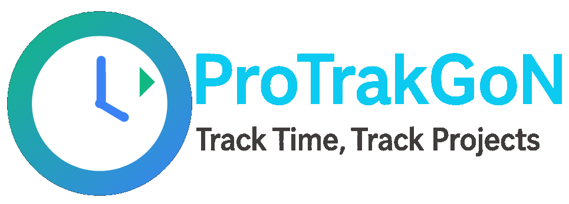

# ProTrakGoN

**PROject TRAcK GO + N** – Time tracking for client projects  
🔧 Go backend implementing JSON:API & 🌐 TypeScript React frontend based on Bootstrap

---

## 🧭 Overview

**ProTrakGoN** is a modern and modular time tracking system for client-based projects.  
It consists of a powerful backend written in Go (following the [JSON:API](https://jsonapi.org/) specification) and a
user-friendly frontend built with TypeScript, React, and Bootstrap.

Use it to track, manage, and evaluate time entries for multiple clients and projects with ease.

---

## 🚀 Features (to come)

- ⏱ Time tracking per user and project
- 👥 Manage clients, projects, and tasks
- 📊 Generate reports and overviews
- 🔄 RESTful API conforming to JSON:API
- 💻 Modern UI with React + Bootstrap
- 🔐 Optional authentication support

---

## ⚙️ Technology Stack

### Backend (Go)

- Go (v1.24)
- [JSON:API](https://jsonapi.org/) standard
- HTTP router: [goltmux](https://github.com/VloRyan/goltmux)
- Database: SQLite

### Frontend (React)

- TypeScript
- React
- Bootstrap 5
- [ts-jsonapi-form](https://github.com/VloRyan/ts-jsonapi-form)
- Tanstack React Query

---

## 🧩 Roadmap

- [ ] Role-based user management
- [x] CSV/~~Excel~~ export
- [ ] Calendar view for time entries
- [ ] OAuth2 / JWT authentication

---

## 🤝 Contributing

Contributions are welcome!  
For major changes, please open an issue first to discuss what you would like to change.

---

## 📄 License

MIT License

